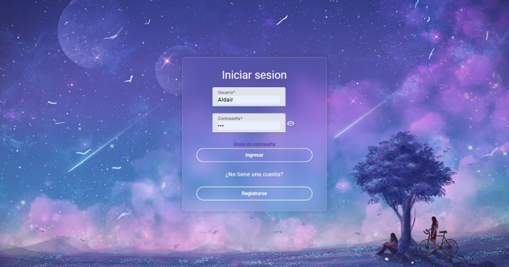
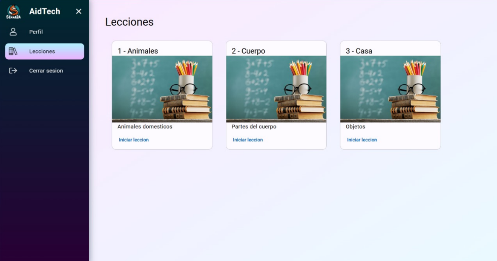
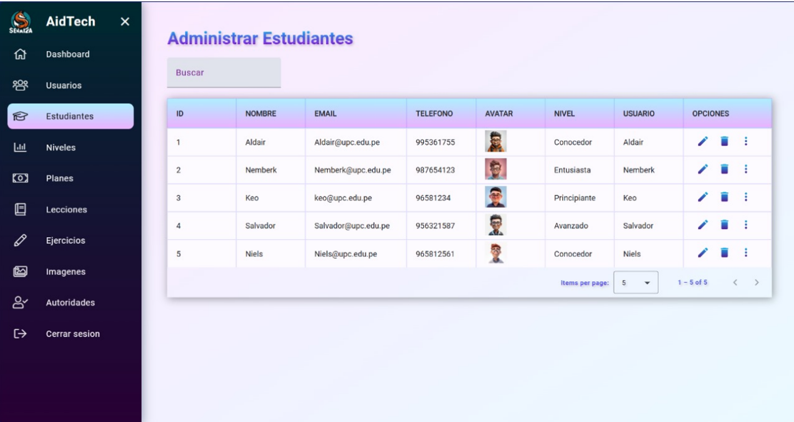

# 🧏‍♂️ Señaliza

**Señaliza** es una plataforma de aprendizaje de lengua de señas diseñada para mejorar la comunicación entre personas sordomudas y sus familiares o amigos. El proyecto cuenta con una interfaz intuitiva, ejercicios personalizados y funcionalidades que fomentan un aprendizaje adaptativo. Ha sido desarrollado con Angular para el frontend y Spring Boot para el backend.

## 📂 Repositorio del backend

https://github.com/TU_USUARIO/señaliza-backend

## 📂 Repositorio del frontend

https://github.com/TU_USUARIO/señaliza-frontend

## 📝 Descripción

Señaliza es una plataforma interactiva y educativa que permite a los usuarios aprender lenguaje de señas a través de ejercicios contextuales, seguimiento de errores y personalización de lecciones. La plataforma está pensada para personas con distintos niveles de experiencia y necesidades de accesibilidad.

## ✅ Funcionalidades

- **Interfaz Accesible:** Opción de minimizar el avatar para utilizar otras aplicaciones mientras se mantiene una guía visual.
- **Ejercicios Contextuales:** Práctica en situaciones reales con retroalimentación inmediata.
- **Revisión de Errores:** Posibilidad de ver y repetir ejercicios en los que se cometieron errores.
- **Seguimiento de Progreso:** Registro del avance del usuario y recomendaciones personalizadas.
- **Personalización de Avatares:** Para una experiencia de aprendizaje más amigable y cercana.
- **Desarrollo Ágil:** Implementado mediante sprints con mejoras iterativas basadas en feedback.
- **Escalabilidad con IA (futuro):** Planificada integración de inteligencia artificial para simular conversaciones y ofrecer ejercicios más avanzados.

## 💡 Tecnologías Utilizadas

- **Frontend:** Angular, Bootstrap, SweetAlert
- **Backend:** Java Spring Boot
- **Base de Datos:** PostgreSQL
- **Lenguajes:** TypeScript, Java
- **Herramientas de Desarrollo:** Git, GitHub, Postman

## 👩🏻‍💻 Uso

1. Inicia sesión con las credenciales creadas en la base de datos.
2. Gestiona la plataforma con el rol ADMIN.
3. Interactúa con la plataforma como cliente con el rol USER para comprar productos, dejar comentarios y valoraciones.

## 📸 Ejecución

### Vista de cliente

Página de Inicio y Login

Ventana de home del usuario con rol de student y la navegación por el side nav, el usuario podrá administrar su perfil y podrá comenzar su aprendizaje iniciando cualquier lección disponible.

### Vista de administrador

Página de Inicio y Login

Ventana de home del usuario con rol de administrador y navegación a través de un side nav, el administrador controla el registro, actualización y eliminación de diferentes entidades. 

